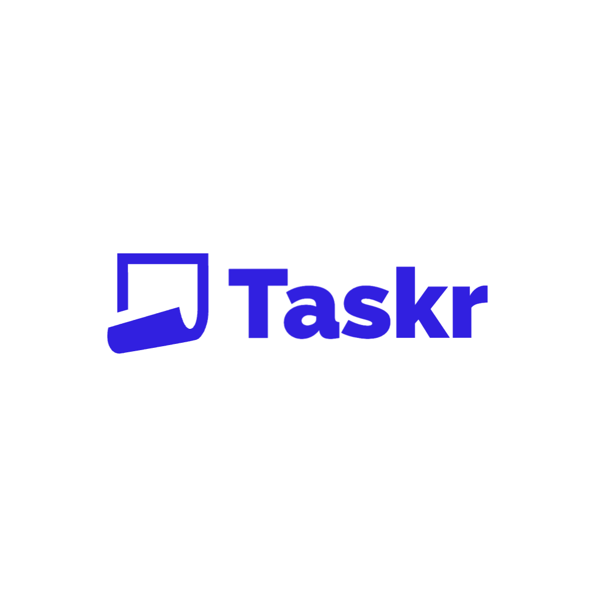
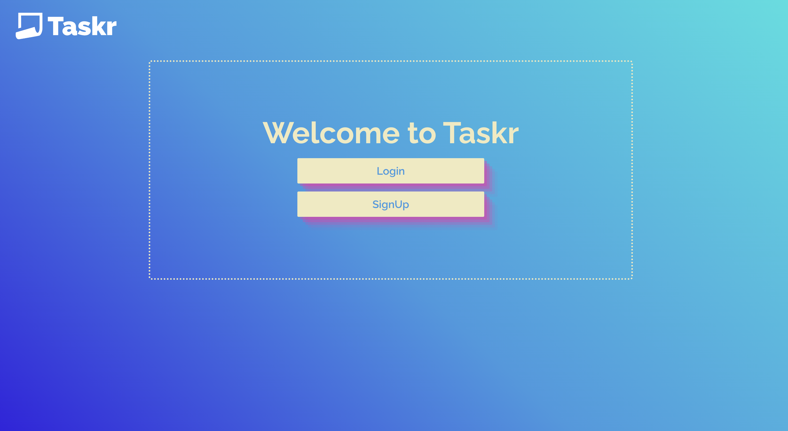
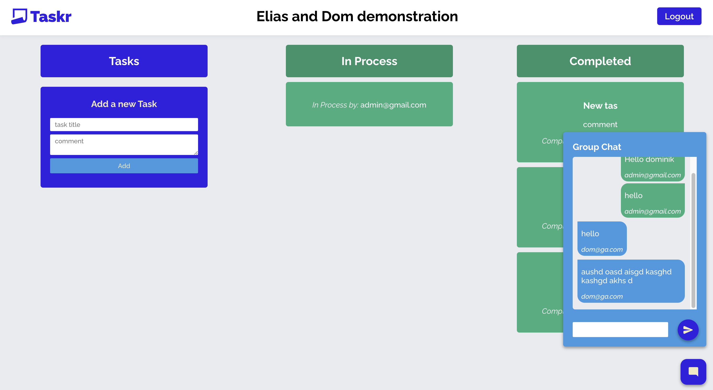

# Nourished

"Taskr" is a web-based application that allows users to create projects and add tasks to identify and track the status of their progress. Taskr allows users to create collaboration projects which keeps track of which user has created, updated and completed individual tasks. The collaboration components also incorperates a chat box which allows collaborative users to communicate within the project.
This application was co-create by Elias Khoury & Dominik Michel.
 

## Login

-   Uses firebase Authentication and encryption to protect user password and email.
-   Google signin function has been implemented as well so the user can sign in directly with their gmail account through a popup menu.
     

## Dashboard

-   Shows both individual and collaboration projects.
-   Forms to add either or both individual and collaboration projects.
     

## Project page

-   Allows users to create tasks.
-   Ability to drag and drop them into the in progress column and/or the completed column.
-   For collaboration Projects, users can chat in the chat bubble created. User details are also displayed when creating, progressing and completing tasks.
     

## Features

1. Sign in (with google sign in included)/Sign out
2. Create Projects and collaboration projects.
3. Add other users to collaboration projects.
4. Group chat available for the users in the collaboration project.

## Tools, Gems and APIs used

-   FireBase for backend
-   React for front end
-   CSS - Done from scratch
-   DND to assist with the Drag N Drop feature setup.
-   React-router-dom used for routes.
-   Firebase tools to host the website.
